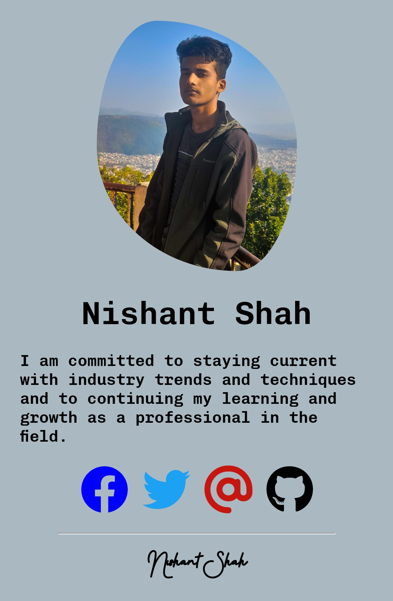

### Hi there 👋

<h3>Nishant Shah</h3>
I'm self-Taught  

  

- 🌱 I’m currently learning UI / UX Design 
- 👯 I’m looking to collaborate on some open source projects.
- 🤔 I’m looking for help with anything I don't know
- 💬 Ask me about Internship 
- 📫 How to reach me: [ns362039@gmail.com](mailto:ns362039@gmail.com)
- 😄 Pronouns: nis_hantshah
- ⚡ Fun fact: I don't know designing 

 

 

 

<h3 align="center">console.log('Empty')</h3>

 

